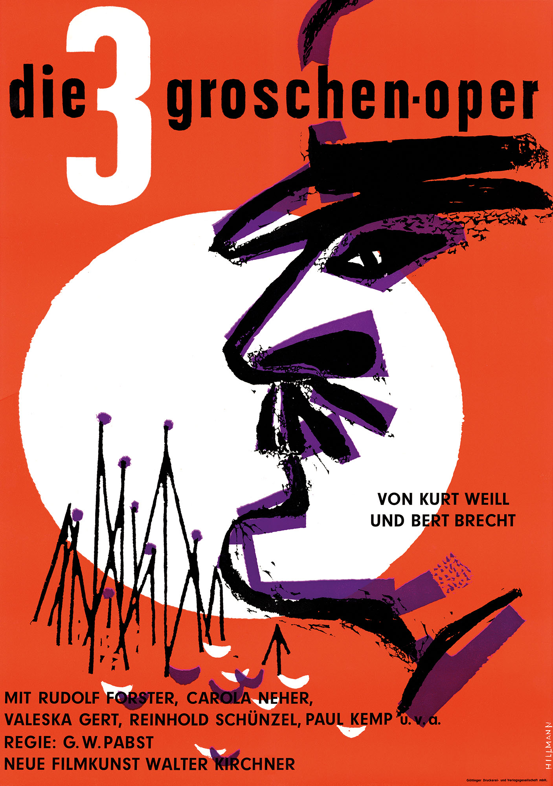
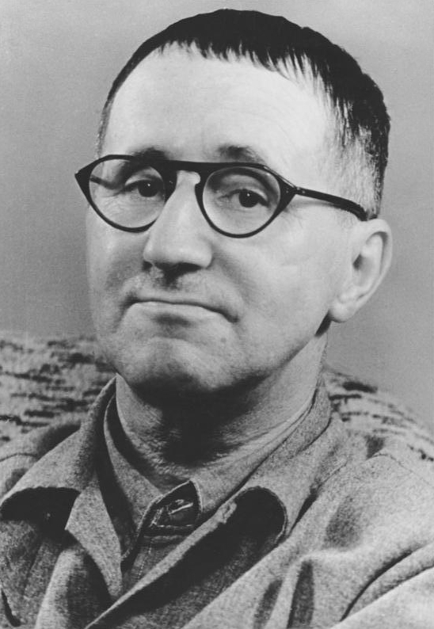
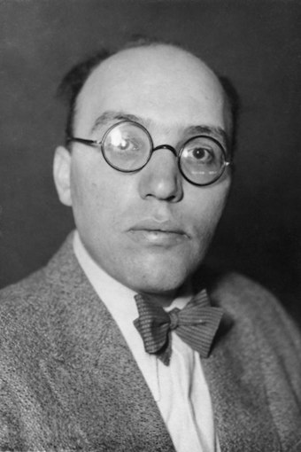
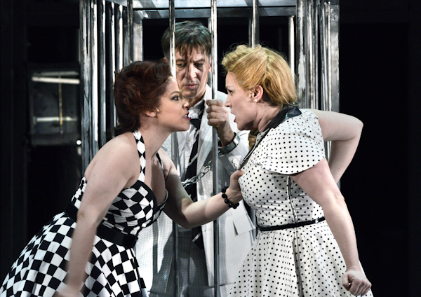
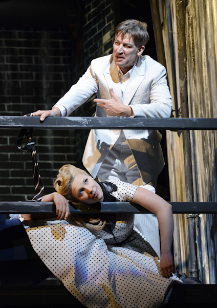
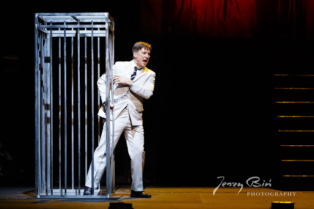
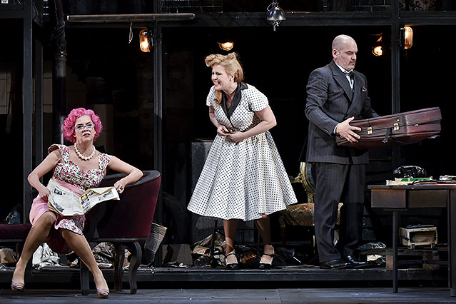
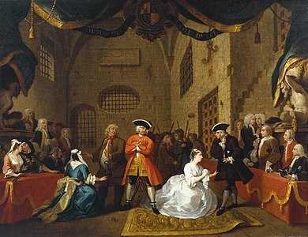
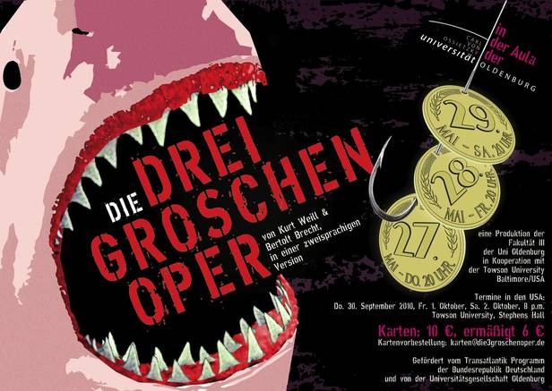

## Die Dreigroschenoper
#### 
Michael Stenz

---

# Allgemein
+ Theaterstück, keine Oper
+ 3 Akte
+ Uraufführung: Berlin 1928
+ Erfolgreichstes deutsches Theater bis 1933
+ Verbot durch den Nazionalsozialismus

---

# Name

"Weil diese Oper so prunkvoll gedacht war, wie nur Bettler sie erträumen, und weil sie doch so billig sein sollte, dass Bettler sie bezahlen können, heißt sie die Dreigroschenoper!"

<!-- einleitender Text von Brecht zur Schallplatten-Aufnahme  -->

---

# Autor
### Bertolt Brecht (1898–1956)  
<!-- Eugen Berthold Friedrich Brecht -->
+ Deutschland  
+ Dramatiker, Lyriker, Regisseur
+ Epischen Theaters
+ Weitere Werke: 
    - Mutter Courage und ihre Kinder
    - Die heilige Johanna der Schlachthöfe

<!-- Brecht gehört zu den bedeutendsten deutschen Dichtern des 20. Jh -->
<!-- Außerdem war Brecht Marxist, und dadurch sind auch seine Werke, stark von seinen Sozialistischen Anschauungen geprägt -->

---

# Komponist
### Kurt Weill (1900–1950)
<!-- Kurt Julian Weill -->
+ Deutschland
+ Komponist, Dirigent
+ Beganteste Stücke:
    - Die Moritat von Mackie Messer
    - Alabama Song (The Doors, David Bowie)
<!-- Weill emigrierte während des Nationalsozialismus in die USA und prägte auch das amerikanische Musiktheater. -->

----

# Gattung

    Drama
###### Text ist für ein Theater ausgelegt

    episches Theater
###### Darstellung größerer gesellschaftlicher Konflikte  <!-- Mischung aus Drama & Epik -->
<!-- Darstellung größerer gesellschaftlicher Konflikte: Koruption in der Gesellschaft-->

----

# Literarische Strömung
    Neue Sachlichkeit
- Wiedergabe der Realität (neutral, realistisch)
- Verzicht auf bildhafte Stilmittel
- Ausführliche Emotionen

----

# Charaktere

+ Macheath => Mackie Messer
+ Jonathan Peachum<!--(Jonathan Jeremiah Peachum Besitzer der Firma Bettlers Freund)-->
+ Celia Peachum (↑ Frau)
+ Polly Peachum (↑ Tochter)
+ „Tiger“ Brown (Polizeichef)
+ Lucy (↑ Tochter)

----

# Charaktere

+ Pastor
+ Die Spelunken-Jenny
+ Filch (Bettler)
+ Bettler, Gangster, Huren, Polizist, Chor 

----

# Vorspiel

- Meginn mit einem Lied (Moritat)
- Die Moritat von Mackie Messer
    -> über die Grausamen Taten von Mackie Messer

----

# Vorspiel

- Meginn mit einem Lied (Moritat)
- Die Moritat von Mackie Messer
    -> über die Grausamen Taten von Mackie Messer

    
"Und der Haifisch, der hat Zähne

    
und die trägt er im Gesicht

    
und Macheath, der hat ein Messer

    
doch das Messer sieht man nicht.“

----

# Akt 1 - London / Soho
* Bettlerkönig Peachum <!-- Dem Bettlerkönig Peachum gehört das Unternehmen bettlers freund -->
* verkauft Lizenzen zum Betteln in London <!-- gegen die hälfte des einkommens --> <!-- Verkauft Lizenz and Bettler Filch -->
* Celia erzählt, dass Polly mit einem Gentleman aus dem Tintenfischhotel ausgeht
* Erkenntniss: Es ist Mackie Messer

----

# Akt 1 - Pferdestall

* Polly und Mackie Messer Heiraten
* Gäste nur Mackies Gangster
* Bringen Gestohlene Möbel
* Polizeichef Brown stößt hinzu
* => gute Freunde (gemeinsam im Krieg)

----

# Akt 1 - Nächster Tag

* Polly erzählt ihren Eltern von der Hochzeit
* Eltern sind erschüttert
* Wollen Macheath anzeigen (Polizei mit Geld bestechen)
<!---->
* Ende 1. Akt <!-- Peachum, Mrs. Peachum und Celia Singen das 1. Dreigroschenfinale -->

----

# Akt 2 - Pferdestall
* Polly warnt Mackie Messer vor der Polizei
* Dieser lässt Polly als Geschäftsleiter
* Macheath flieht
* ...ins Bordell

----

# Akt 2 - Bordell
* Er trifft seine Ex-Geliebte (Jenny)
* Diese Verrät ihm
* Mackie wird Festgenommen

---

# Akt 2 - Gefängnis (Käfig)
* Lucy besucht Mackie im Gefängins <!-- weil sie gehört hat, dass Mackie jetzt mit einer anderen verheiratet ist -->
* Polly besucht ihm auch Zeitgleich <!-- Eifersuch und ein kleiner Streit entsteht -->
* Mackie kann sich gut herausreden <!-- Außerdem schafft er es Lucy zu überreden ihm bei der Flucht zu Helfen -->
* Lucy hilft ihm bei der Flucht
<!---->
* Ende 2. Akt <!-- Jenny & Mackie Singen das 2. Dreigroschenfinale -->

---

# Akt 3 - Peachums Bettlergarderbode
* Krönungstag von Queen Victoria
* Peachum droht Krönung mit Bettlern zu ruinieren
* Mackie wird wieder Festgenommen

----

# Akt 3 - Todeszelle
* Mackie versucht sich mit Geld freizuzahlen
* schickt seine Bande zum Geldabheben <!-- Ebenso fragt er polly, doch diese hatte schon alles wie ausgemach woanders hingeschickt -->
* rechnet noch seine Schulden mit Brown ab <!-- Während Mackies letzter mahlzeit, die aus Spargel besteht gibt er Brown noch dass Geld, dass er ihm schuldig ist. Brown hat allerdings schon onehin ein schlechtes gewissen  --> 
* Peachum kommt zur Hänkung
* Kurz davor kommt Brown und Verkündet direkt von der Königin, dass Mackie Begnadigt wurde. <!-- und ebenso in den Adelsstand erhoben wirde  -->

* Ende 3. Akt
<!-- Mit diesem satyrischem endet die dreigroschenoper, er zeigt nicht nur, dass der böse schwerverbrecher von der hinrichtung verschont wird, sondern auch zum Adel erhoben wird. Dadurch wird auch Stark die Soziale ungerechtikeit hervorgehoben -->

---

## Interpretation

### Stoff
    Beggar's Opera (John Gay, 1728)

<!-- Die Dreigroschenoper ist eigentlich nur eine Bearbeitete der Beggars Opera von dem Londoner John Gay. Diese wurde später von Elisabeth Hauptmann ins deutsche übersetzt, und von Brecht bearbeitet. Laut Historikern können bis zu 80% auf das Grundwerk zurückgeführt werden -->
    
### Motive
    Kritik am Kapitalismus, Korruption

----

### Zeit

#### Erzählzeit
    ~2 Stunden

#### Erzählte Zeit
    ~1 Woche

#### Zeit der Handlung
    1837 (Krönung Victorias)

----

### Milieu
    Londoner Unterwelt

### Soziokultureller Hintergrund
    Marxismus, Weimarer Republik (Hyperinflation & Arbeitslosigkeit)

<!-- Marxismuss = Klassenlose Gesellschaft -->

----

<h1>Haifisch - Rammstein</h1>

    
„Und der Haifisch, der hat Zähne

    
und die trägt er im Gesicht

    
und Macheath, der hat ein Messer

    
doch das Messer sieht man nicht.“

– Die Moritat von Mackie Messer

    
„Und der Haifisch, der hat Tränen

    
und die laufen vom Gesicht

    
doch der Haifisch lebt im Wasser

    
so die Tränen sieht man nicht.“

– Haifisch - Rammstein

----

# Persönliche Meinung

+ 👍 Sehr unterhaltsam 
+ 👍 Sympathie für Mackie Messer 
+ 👎 etwas viel Gesang

----

---

## Quellen
https://www.litwiss-online.uni-kiel.de/wp-content/uploads/2015/09/V.-Brecht-Die-Dreigroschenoper.pdf
https://www.spiegel.de/geschichte/die-moritat-von-mackie-messer-song-von-bertolt-brecht-und-kurt-weill-a-243b199d-6e87-41ee-a5ff-0aae2d310398
https://de.wikipedia.org/wiki/Die_Dreigroschenoper
https://www.orf.at
